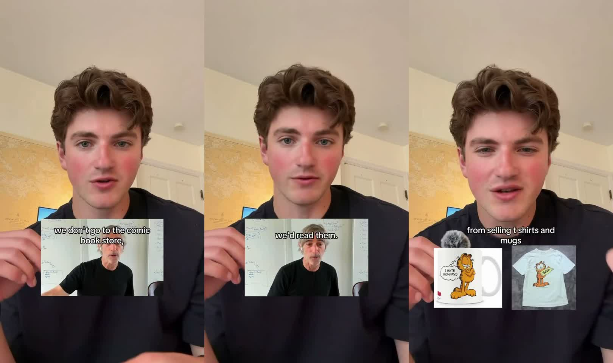

# Garfield no jornal, não na loja de quadrinhos

## Transcrição (original · Whisper large-v3 via Groq)

```
[00:00] A few days ago, a legendary entrepreneur said,
[00:02] we don't go to the comic book store, but if the comics were in the newspaper, we'd read them.
[00:05] This quote genuinely shifted my perspective on how the next generation of millionaires is being made.
[00:10] Because hear me out, Garfield was free in every newspaper, which is how millions came to recognize it.
[00:15] They made their billions from selling t-shirts and mugs.
[00:18] Like, the genius Gen Z entrepreneurs are not building comic book stores.
[00:21] They are simply appearing in the newspaper.
[00:24] The single greatest advantage is existing where all the attention lives, which is social media,
[00:29] and then building a brand to leverage it.
[00:31] Because the thing is, nobody goes out of their way for a comic book store,
[00:34] but they won't skip it if it's in their hands.
```

## Tradução

```
[00:00] Alguns dias atrás, um empreendedor lendário disse:
[00:02] "a gente não vai até a loja de quadrinhos, mas se os quadrinhos estivessem no jornal, a gente leria."
[00:05] Essa frase mudou de verdade a forma como eu enxergo como a próxima geração de milionários está sendo feita.
[00:10] Porque presta atenção: o Garfield era de graça em todo jornal — foi assim que milhões passaram a reconhecê-lo.
[00:15] E os bilhões vieram da venda de camiseta e caneca.
[00:18] Os empreendedores geniais da Geração Z não estão construindo lojas de quadrinhos.
[00:21] Eles simplesmente aparecem no jornal.
[00:24] A maior vantagem que existe é estar onde a atenção mora — as redes sociais —
[00:29] e aí construir uma marca para alavancar isso.
[00:31] Porque ninguém sai do caminho para ir a uma loja de quadrinhos,
[00:34] mas ninguém pula o quadrinho quando ele já está na mão.
```

## Arquitetura
| Tempo | Fase | O que acontece | Função |
|---|---|---|---|
| 00:00–00:05 | **Citação** | "um empreendedor lendário disse…" | autoridade emprestada no 1º segundo |
| 00:05–00:10 | **Confissão de mudança** | "isso mudou minha perspectiva" | ele se coloca como aluno da frase, não dono |
| 00:10–00:18 | **Analogia-ponte** | Garfield grátis no jornal → bilhões em caneca | um caso que todo mundo conhece prova a frase |
| 00:18–00:24 | **Releitura para hoje** | Gen Z não constrói loja, aparece no jornal | traduz 1980 para 2026 |
| 00:24–00:31 | **Tese** | estar onde a atenção mora + marca para alavancar | a regra, dita inteira |
| 00:31–00:37 | **Frase-espelho** | ninguém vai à loja / ninguém pula o que está na mão | fecha repetindo a abertura com outra forma |

## Decupagem visual
*Medida quadro a quadro (2 fps + luminância a cada 0,1s). 720×1280, 30fps.*



**Base o vídeo inteiro:** selfie na mão, ambiente doméstico claro, camiseta preta lisa, gesticulação
constante, **microfone de lapela com espuma na mão** (aparece como objeto de cena). Legenda branca,
bold, 1-2 linhas, **no meio da tela, sobre o peito** — nunca no rodapé. **Sem B-roll em tela cheia:**
o rosto nunca sai.

| Tempo | Inserção | Posição | O que mostra | Sincronia |
|---|---|---|---|---|
| **2,4 – 5,9s** | 🎬 **clipe do empreendedor** (picture-in-picture) | card retangular ~45% da largura, terço inferior, sobre o peito | o próprio empreendedor falando a frase: homem grisalho, camiseta preta, quadro branco atrás | **a citação é dita por ele no clipe** — a boca dele se mexe e a do bitterbuilds fica fechada em 5,3s. Legenda da frase **sobre o card** |
| **16,9 – 18,5s** | 🖼️ **2 fotos de produto** lado a lado | mesma zona, sobre o peito | caneca do Garfield *"I hate Mondays"* + camiseta do Garfield | entra exatamente em *"selling t-shirts and mugs"*, sai em *"Gen Z entrepreneurs"* |

**Regra das inserções dele:**
1. **Só duas**, e cada uma prova **uma afirmação**: quem disse · de onde veio o dinheiro
2. **Duração = a frase que ela prova** (3,5s e 1,6s) — nem um segundo a mais
3. **Card pequeno, rosto sempre visível** — a inserção é evidência, não troca de cena
4. **A voz da autoridade é a da própria autoridade** — ele não repete a citação, deixa o clipe falar

⚠️ **O nome do empreendedor não aparece no vídeo** — nem na legenda, nem no card.
✅ **Fonte confirmada: Mark Pincus, fundador da Zynga, no Lenny's Podcast** (publicado 14/06/2026 —
uma semana antes do post do bitterbuilds). Pista veio do comentário de @anuroop_kumar; confirmada pela
legenda do episódio: https://youtu.be/7eh9C3TUotc **aos 51:25**.

**O contexto real da frase** (legenda do episódio, 50:53–51:37):
> *"I believe this could be and should be a mass market activity. I believe adults want to give
> themselves permission to play, but I got to make it so accessible, so cheap in terms of what it asks
> for them. Free. […] Three clicks and you're in. […] You're going to trip over it. It's a breadcrumb
> somewhere. You're not going to — like I say, we don't go to the comic book store, but if the comics
> were in the newspaper, we'd read them. So I believed there was a latent demand. And in fact, today,
> gaming is a $280 billion industry."*

**Leitura:** o Pincus fala de **demanda latente e atrito** — o jogo tem que estar no caminho de quem
nunca iria procurá-lo (FarmVille dentro do Facebook). **O Garfield é invenção do bitterbuilds**, não do
Pincus. Para o seu roteiro isso é ainda melhor: *"ninguém vai procurar, mas tropeça se estiver no
caminho"* é exatamente o lead que chega sozinho e precisa ser atendido na hora.

**Crédito correto em legenda:** *Mark Pincus, fundador da Zynga — Lenny's Podcast, jun/2026*.

**Clipe recortado:** `Downloads/garfield-citacao-clipe-recortado.mp4` — 3,5s, 864×540, com áudio.
Vem com a legenda em inglês **queimada na imagem** e resolução baixa (ampliado 2× de um card de ~430px).
Serve para teste e rascunho; para publicar, usar o trecho da entrevista original.

**Números do post (16/09):** 24,8 mil curtidas · 88 comentários · 709 no terceiro contador · publicado em 21/06.

## Mecânicas
1. **Citação de autoridade** — é **exatamente o formato A FRASE** que você propôs (frase de livro/pessoa + sua leitura). Prova em 37s que funciona
2. **Autoridade sem nome** — "um empreendedor lendário". Dá o peso sem permitir checagem. ⚠️ ver abaixo
3. **Analogia-ponte** — a frase abstrata só vira convicção quando o Garfield aparece. **Frase + caso concreto** é o par que falta em quase todo card de citação
4. **Releitura geracional** — o mesmo movimento do "foi escrito em [ano], hoje significa outra coisa" (saída 2 da regra d'A FRASE)
5. **Frase-espelho** — fecho que ecoa a citação de abertura. Dá sensação de ciclo fechado em 37s
6. **Curto demais para ter gordura** — 11 frases, nenhuma repetida. Densidade é a mecânica

## O que não copiar
| Elemento | Por quê |
|---|---|
| **"Um empreendedor lendário" sem nome** | no Arquiteto a fonte é nomeada. Se não souber quem disse, não use — ou diga "li isso e não achei o autor" |
| **"A próxima geração de milionários"** | promessa de riqueza — registro de guru; o brand book veta resultado prometido |
| **"Estar nas redes"** como tese | é tese de **creator**. A sua não é aparecer — é o que a empresa faz com a atenção quando ela chega |

## Esqueleto (A FRASE)
```
[0s]   CITAÇÃO           "[Pessoa nomeada] disse: '[frase]'."
[5s]   IMPACTO           "Isso mudou como eu vejo [tema]."
[10s]  CASO-PONTE        um exemplo que todo mundo conhece e prova a frase
[18s]  RELEITURA HOJE    "quem está ganhando agora não faz [velho]. Faz [novo]."
[24s]  TESE              a regra, dita inteira
[31s]  ESPELHO           a frase de abertura reescrita como conclusão
```

## Adaptação — a arbitragem

**O ângulo que é seu:** ele diz *esteja onde a atenção mora*. Você completa com a parte que ninguém
diz: **a atenção chega — e morre na porta**.

### Roteiro com as inserções — mesma gramática visual da referência

*Base igual à dele: selfie, fundo claro, camiseta lisa escura, legenda branca bold sobre o peito,
rosto sempre visível. Duas inserções como ele + uma terceira que é a sua prova.*

| Tempo | Fala | Inserção | Posição e duração |
|---|---|---|---|
| 0 – 2s | *"Alguns dias atrás eu ouvi uma frase que mudou como eu vejo empresa."* | — | — |
| **2 – 6s** | *[a frase na voz de quem disse]* | 🎬 **INSERÇÃO 1 · clipe da autoridade** falando a frase, com legenda em PT **sobre o card** | PiP, terço inferior, ~45% da largura · **só enquanto a frase dura** |
| 6 – 10s | *"Ele estava falando de quadrinho. O Garfield saía de graça em todo jornal."* | — | — |
| **10 – 12s** | *"E o dinheiro veio da caneca e da camiseta."* | 🖼️ **INSERÇÃO 2 · caneca + camiseta do Garfield** lado a lado | mesma zona · **entra na palavra "caneca", sai no fim da frase** (~1,6s) |
| 12 – 17s | *"Todo empreendedor aprendeu essa metade: aparecer onde as pessoas estão. Instagram, Google, anúncio."* | — | — |
| 17 – 21s | *"Só que ninguém fala da outra metade: a loja tem que estar aberta quando o cara chega."* | — | — |
| **21 – 26s** | *"O lead chama no WhatsApp às 22h. Recebe resposta às 10h da manhã."* | 📱 **INSERÇÃO 3 · print real de WhatsApp** com o horário da mensagem e o da resposta **destacados** | mesma zona · **entra em "22h"**, o destaque do "10h" acende na fala · ~4s |
| 26 – 30s | *"Ele leu a tirinha. E encontrou a loja fechada."* | — | — |
| 30 – 35s | *"Aparecer no jornal todo mundo já aprendeu. O dinheiro está em ter a loja aberta quando ele chega."* | — | — |

**As três inserções provam três coisas diferentes:** quem disse (autoridade) · de onde veio o dinheiro
(caso) · **que isso acontece na empresa real** (a sua prova — a que a referência não tem).

### Como conseguir cada inserção

| Inserção | Onde | ⚠️ Antes de publicar |
|---|---|---|
| **1 · clipe da autoridade** | trecho de entrevista/podcast de quem disse a frase, 3-4s | **identificar quem é** (não aparece no vídeo dele) e usar só um trecho curto, com o nome na legenda. Sem fonte → corta a inserção e diz *"li essa frase e não achei o autor"* |
| **2 · caneca + camiseta** | foto de produto licenciado do Garfield | é marca registrada: usar como **referência editorial**, sem sugerir parceria |
| **3 · print do WhatsApp** | **conversa real** de uma operação que você atende, com o horário visível | **apagar nome, foto e número do lead**. Nunca montar print falso — é a regra do Arquiteto: tela real ou nada |

**Variação se não achar o clipe:** a frase aparece como **card de texto** no mesmo lugar e tempo
(branco sobre preto, aspas grandes), e você fala a frase. Perde a voz da autoridade, mantém o ritmo.
Mantém: citação + caso-ponte + releitura + espelho em ~35s.
Troca: "apareça nas redes" (tese de creator) por **"a atenção chega e morre na porta"** (tese de operação).
Liga direto ao `vs-2026-09-14-dor-lead-espera` — pode ser o mesmo tema em dois formatos.

⚠️ **Fonte:** a atribuição da frase e o número de faturamento do Garfield **não foram verificados**.
Antes de gravar, checar quem disse e usar só o que tiver fonte.
